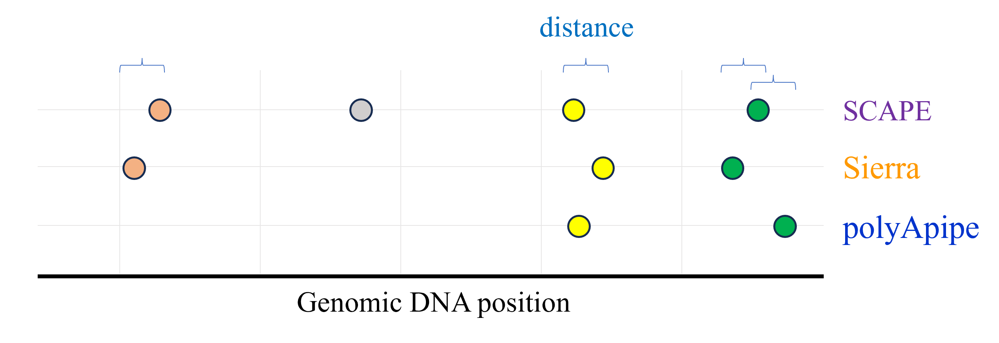
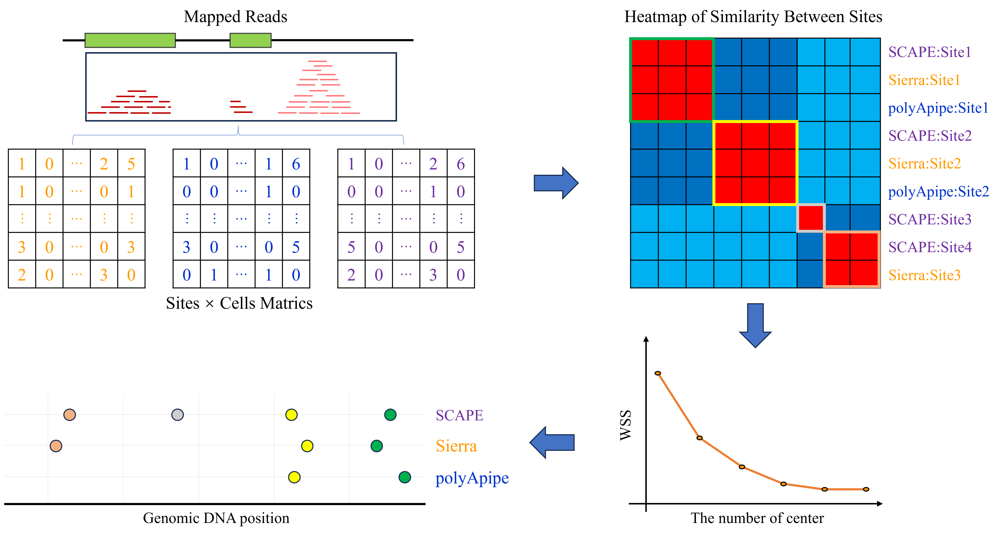

# metaAPA

We designed two strategies to integrate the outputs of these tools, enabling researchers to select appropriate polyA site sets based on their specific needs.
## Overview

The main pipeline is divided into two parts:

1. **Position-based Method**: Calculate the distance between genomic coordinates of sites from different sources, grouping sites with distances below a specified threshold into clusters, with each cluster representing a true signal.



2. **Similarity-based Method**: Perform unsupervised clustering of sites from different sources based on expression similarity. After optimizing the number of clustering centers, the resulting clusters represent the integrated results.



## Updates

## Requirments

1. Install Nextflow (version 23.04.3.5875)
2. Create conda environment (yaml in the conda_env folder)

## Directory structure
This pipeline consists of three directories: 

+ **bin**: R scripts 
+ **modules**: Nextflow processes 
+ **conda_env**: conda environment

 
The main.nf is the pipeline to integrate polyA sites. Besides, we provided two workflows to get the input:
+ **apatools.nf**: run Sierra, polyApipe, and SCAPE tools
+ **preprocess.nf**: include site annotation, expression normalization and conversion from count matrix to bed format
	
## Usage
Before running the integration pipeline, users need to run apatools.nf and preprocess.nf to get the input.

The usage of apatools.nf is as follows:

```
nextflow run apatools.nf --sample_name ${sample_name} --method ${apa_method} --data_dir ${input} --core_num 8 --job_id ${SLURM_JOB_ID} --barcode_file ${barcode_file} --reference_file ${reference_file} --genome_version ${genome_version} -profile conda
```

The `${input}` is the output folder of cellranger or spaceranger which includes bam file and bam.bai file. The `${genome_version}` needs to be consistent with `${reference_file}`. If the genome is mm10, then the reference should be refdata-gex-mm10-2020-A/genes/genes.gtf. If the genome is GRCm39, then the reference should be refdata-gex-GRCm39-2024-A/genes/genes.gtf. Both references can be downloaded from [Cell Ranger website] (https://www.10xgenomics.com/support/cn/software/cell-ranger/downloads#reference-downloads).

The usage of preprocess.nf is as follows:
```
nextflow run preprocess.nf --sample_name ${sample_name} --method ${apa_method} --apa_input ${apa_input} --core_num 8 --barcode_file ${barcode_file} --reference_file ${reference_file} --genome_version ${genome_version} --gene_dir ${gene_dir} --annotation_dir ${annotation_dir} -profile conda
```

The `${apa_input}` is the output folder of apatools.nf which includes all tools' outputs. The `${annotation_dir}` is the folder of annotation of sites (one of outputs of the workflow). The `${gene_dir}` is the folder to store gene-level matrix which will be used to normalize apa counts.

The usage of the integration pipeline is as follows:

1. Run one condition 

```
nextflow run main.nf --sample_name ${sample_name} --apa_input ${apa_input} --core_num 8 --barcode_file ${barcode_file} --distance_method "cosine" --cluster_method "kmeans-wss" --distance "50" --metatools_output ${metatools_output} -profile conda 
```
2. Run multiple conditions

```
nextflow run main.nf --sample_name ${sample_name} --apa_input ${apa_input} --core_num 8 --barcode_file ${barcode_file} --distance_method "[spearman, cosine, Jaccard, pearson, none, norm, euclidean]" --cluster_method "[hdbscan, hclust, pam-wss, pam-asw, kmeans-wss, kmeans-asw]" --distance "[0, 3000, 100]" --metatools_output ${metatools_output} -profile conda -with-report ${sample_name}_report.html -with-timeline ${sample_name}_timeline.html
```

## Citation
Zhao, Q., & Rattray, M. (2025). metaAPA: a tool for integration of PolyA site predictions from single-cell and spatial transcriptomics
